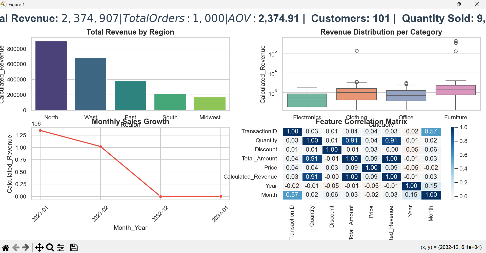

# 📊 E-Commerce Sales Intelligence Dashboard

**An End-to-End Data Engineering & Business Analytics Project**



---

## 🌟 Project Overview

This project builds a complete analytical pipeline that transforms raw, fragmented e-commerce data into a strategic business dashboard.  
 
**Key Goal:** build a robust data pipeline for **data cleaning, merging multiple sources**, and **visualizing key business metrics** to drive **data-informed decision-making**.
Data preservation + data standardization, not deletion.  
All business signals (returns, negative values, anomalies) are preserved and clearly reflected in the dashboard to support honest decision-making.

---

## 📖 Data Engineering Pipeline (From Raw to Ready)

### 1. Data Profiling & Quality Assessment
The raw transaction data was first explored to identify:
- Missing values
- Duplicated rows
- Negative quantities (returns)
- Inconsistent date formats
- Mixed data types
- Extreme values (outliers)

⚠️ **Important:**  
No business data was deleted. Returns, negative revenue, and extreme values were preserved to maintain data integrity.

---

### 2. Data Cleaning & Standardization
Goal: Make the data usable without altering reality.

**Steps applied:**
- Standardized column names
- Converted strings to numeric where applicable
- Parsed and unified date formats
- Preserved negative values (returns)
- Kept outliers after analysis
- Ensured numeric fields support aggregation

---

### 3. Single Source of Truth (Fact Table)
Multiple datasets were merged to create a unified analytical layer:  

**Fact Table:** `fact_sales_features.csv`  
Includes:
- Sales
- Products
- Customers

**Feature Engineering:**
- `Month_Year`
- `Day_Date`
- `Total_Revenue = Quantity * Price (1-Discount)`
- Return transactions reflected as negative revenue

> This table is the trusted analytical base for all dashboards.

---

## 📊 Key Metrics & Analysis
Using **Python** and **Pandas**:
- Monthly Revenue Trend
- Category Revenue Distribution
- Regional Sales Performance
- Correlation between Price, Quantity, and Revenue

---

## 📈 Dashboard Insights & Recommendations

### 1. Regional Performance
- **Insight:** North region dominates total revenue.
- **Recommendation:** Focus inventory and marketing campaigns there. 

### 2. Category Behavior
- **Insight:** Furniture and Clothing show high variance and extreme values;Electronics is stable.
- **Recommendation::** Opportunity for premium upselling strategies.

### 3. Revenue Decline
- **Insight:** A noticeable drop appears after early 2023.  
- **Recommendation::** Requires business & data pipeline investigation.

---

## 🛠️ Technical Stack
- **Python**
- **Pandas** – ETL & feature engineering
- **Matplotlib & Seaborn** – Visualization
- **CSV-based Data Warehouse Layer**

---

## 🧩 Dashboard Architecture
- **Bar Chart** → Revenue by Region  
- **Box Plot** → Revenue distribution by Category  
- **Line Chart** → Monthly Revenue Trend  
- **Heatmap** → Feature Correlation Matrix  

---

## 🚀 Future Enhancements
- Sales Forecasting Model  
- RFM Customer Segmentation  
- Automated PDF Reporting  
- Streamlit Interactive Dashboard

---
## 📁 How to Run
1. Ensure Python is installed.  
2. Install dependencies:
```bash
pip install pandas seaborn matplotlib
